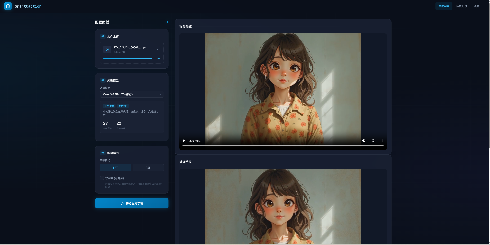
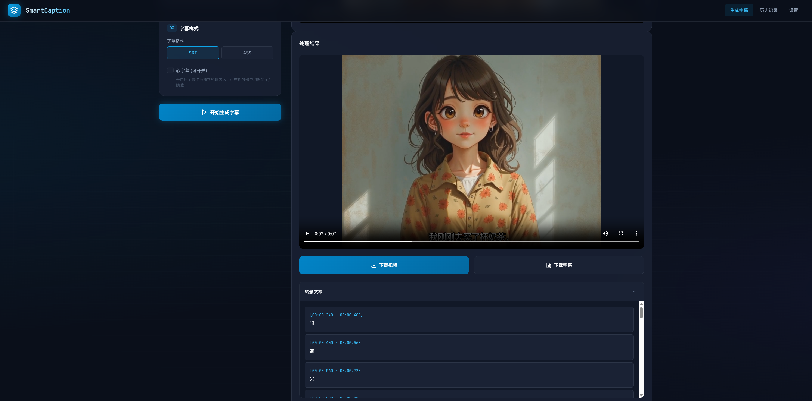

# SmartCaption - 智能字幕生成器

基于 AI 的智能字幕生成应用，支持从音视频文件自动生成字幕，提供优雅的 Web 界面和多种 ASR 模型选择。


## ✨ 功能特性

- 🎯 **多模型支持**: Qwen3-ASR-1.7B、Qwen3-ASR-0.6B、Whisper Large V3
- 🎨 **可配置字幕样式**: 位置、字体、大小、颜色、描边等
- 🎬 **视频处理**: 音频提取、字幕烧录、软字幕支持
- 🌐 **现代 Web 界面**: 简约科技风设计，支持拖拽上传
- 📊 **智能分段**: 自动合并短片段，生成可读性更好的字幕
- 🚀 **实时预览**: 上传即预览，处理完成直接播放

## 🎬 效果演示


## 🎨 界面预览

### 系统截图

| 主界面 | 处理中/结果页 |
|:------:|:-------------:|
|  |  |
| 上传视频、选择模型和配置字幕样式 | 实时处理进度和处理结果展示 |

### Web 界面特点

- **深色主题**: 科技蓝配色，护眼的深色背景
- **拖拽上传**: 支持拖拽文件上传，操作便捷
- **实时预览**: 上传视频后立即预览
- **简洁处理状态**: 优雅的加载动画，无干扰的处理过程
- **结果展示**: 处理完成后直接播放带字幕的视频

### 配置选项

- **ASR 模型**: 支持多种模型切换，自动显示模型信息
- **字幕格式**: SRT / ASS 格式可选
- **字幕样式**: 位置、字体、大小、颜色、描边宽度
- **软字幕**: 可选嵌入可开关的软字幕

## 📁 项目结构

```
SmartCaption/
├── frontend/           # 前端界面
│   ├── index.html     # 主页面
│   ├── styles.css     # 样式文件（简约科技风）
│   └── app.js         # 前端交互逻辑
├── backend/           # 后端服务
│   ├── app/
│   │   ├── api.py           # FastAPI 接口
│   │   ├── core/            # 核心配置
│   │   ├── models/          # ASR模型适配器
│   │   ├── services/        # 业务服务
│   │   └── utils/           # 工具函数
│   ├── requirements.txt     # 依赖列表
│   └── run_gradio.py        # Gradio 启动脚本
└── docs/
    └── PRD.md         # 产品需求文档
```

## 🚀 快速开始

### 环境要求

- Python 3.10+
- FFmpeg
- NVIDIA GPU (推荐，用于 CUDA 加速)

### 安装 FFmpeg

```bash
# Windows (使用 chocolatey)
choco install ffmpeg

# macOS
brew install ffmpeg

# Ubuntu/Debian
sudo apt-get install ffmpeg
```

### 创建 Conda 隔离环境（推荐）

使用 Conda 创建独立的 Python 环境，避免与系统环境冲突：

```bash
# 创建新环境（Python 3.10）
conda create -n smartcaption python=3.10 -y

# 激活环境
conda activate smartcaption

# 进入后端目录
cd backend

# 安装依赖
pip install -r requirements.txt
```

> **⚠️ 重要提示：PyTorch 与 CUDA 版本对应**
> 
> 如果你的电脑有 NVIDIA 显卡，请确保安装的 PyTorch 版本与 CUDA 版本匹配：
> 
> ```bash
> # 查看 CUDA 版本
> nvidia-smi
> 
> # 根据 CUDA 版本安装对应 PyTorch（示例）
> # CUDA 12.1
> pip install torch torchvision torchaudio --index-url https://download.pytorch.org/whl/cu121
> 
> # CUDA 11.8
> pip install torch torchvision torchaudio --index-url https://download.pytorch.org/whl/cu118
> 
> # CPU 版本（无显卡）
> pip install torch torchvision torchaudio --index-url https://download.pytorch.org/whl/cpu
> ```
> 
> 更多版本请参考：[PyTorch 官方安装指南](https://pytorch.org/get-started/locally/)

### 启动服务

#### 方式一：启动 Web 界面（推荐）

```bash
# 确保已激活 conda 环境
conda activate smartcaption

cd backend
python run_api.py
```

访问 http://127.0.0.1:8000 使用现代 Web 界面。

#### 方式二：启动 Gradio 界面

```bash
# 确保已激活 conda 环境
conda activate smartcaption

cd backend
python run_gradio.py
```

访问 http://localhost:7860 使用 Gradio 界面。

## 🔧 API 接口

### 处理视频

```http
POST /api/process
Content-Type: multipart/form-data

file: <视频文件>
model_type: "Qwen/Qwen3-ASR-1.7B"
subtitle_format: "srt"
position: "bottom"
font_name: "Arial"
font_size: 24
font_color: "#FFFFFF"
outline_color: "#000000"
outline_width: 2
soft_subtitle: false
```

### 获取模型列表

```http
GET /api/models
```

### 健康检查

```http
GET /api/health
```

## 🧠 支持的模型

| 模型 | 参数量 | 特点 | 适用场景 |
|------|--------|------|----------|
| Qwen/Qwen3-ASR-1.7B | 1.7B | 中文效果优秀，速度快 | 中文视频（推荐） |
| Qwen/Qwen3-ASR-0.6B | 0.6B | 轻量级，资源占用低 | 快速预览 |
| openai/whisper-large-v3 | 1.5B | 多语言支持好，精度高 | 多语言视频 |

## ⚠️ 注意事项

1. **首次运行**: 首次使用需要下载模型，根据网络情况可能需要几分钟
2. **GPU 加速**: 如果有 NVIDIA GPU，会自动使用 CUDA 加速
3. **PyTorch 版本**: 请确保 PyTorch 版本与 CUDA 版本匹配，否则可能无法使用 GPU 加速
4. **内存需求**:
   - Qwen3-ASR-1.7B: 建议 6GB+ 显存
   - Qwen3-ASR-0.6B: 建议 3GB+ 显存
   - Whisper Large V3: 建议 6GB+ 显存
5. **文件格式**: 支持 MP4、MKV、AVI、MOV、WebM、MP3、WAV 等常见音视频格式

## 🛠️ 技术栈

### 前端
- HTML5 + CSS3 + JavaScript (原生)
- 简约科技风设计
- 响应式布局

### 后端
- FastAPI - 高性能异步 Web 框架
- Python 3.10+
- FFmpeg - 音视频处理

### AI 模型
- Qwen3-ASR - 阿里云通义千问语音识别
- Whisper - OpenAI 多语言语音识别

## 📄 许可证

MIT License

## 🤝 贡献

欢迎提交 Issue 和 Pull Request！

## 📧 联系

如有问题或建议，欢迎通过 GitHub Issues 联系。
